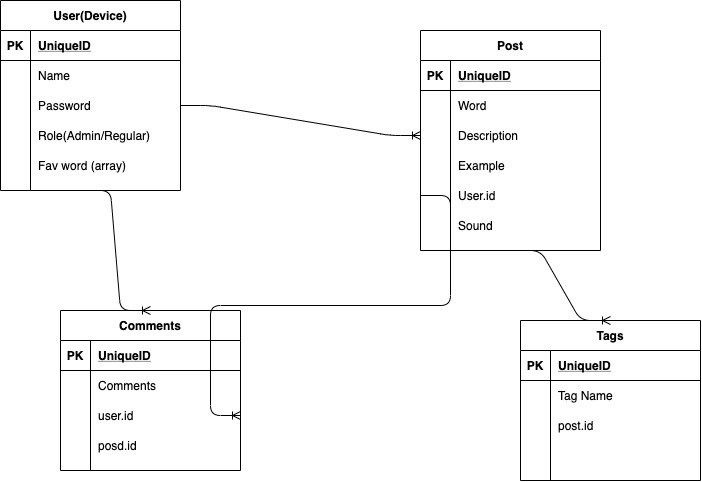
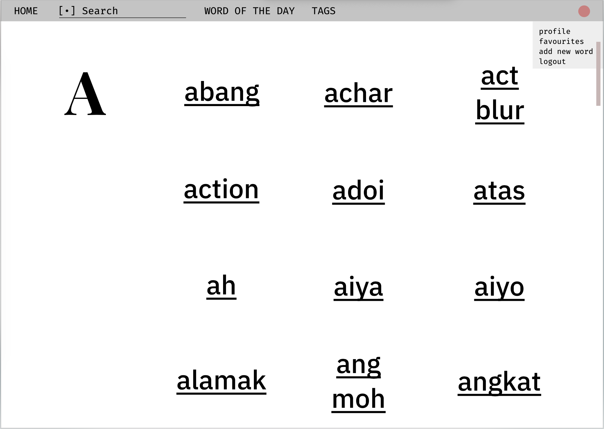
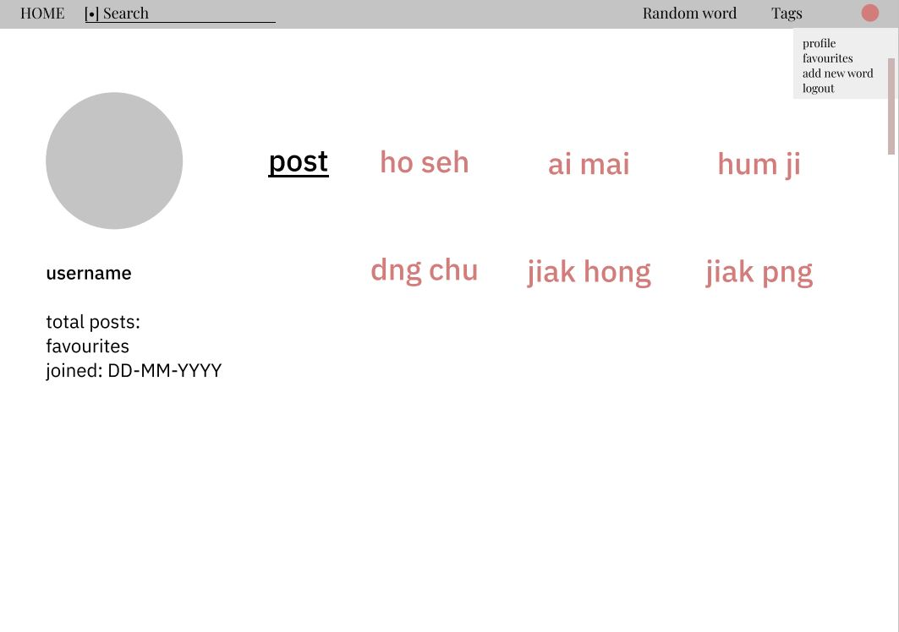
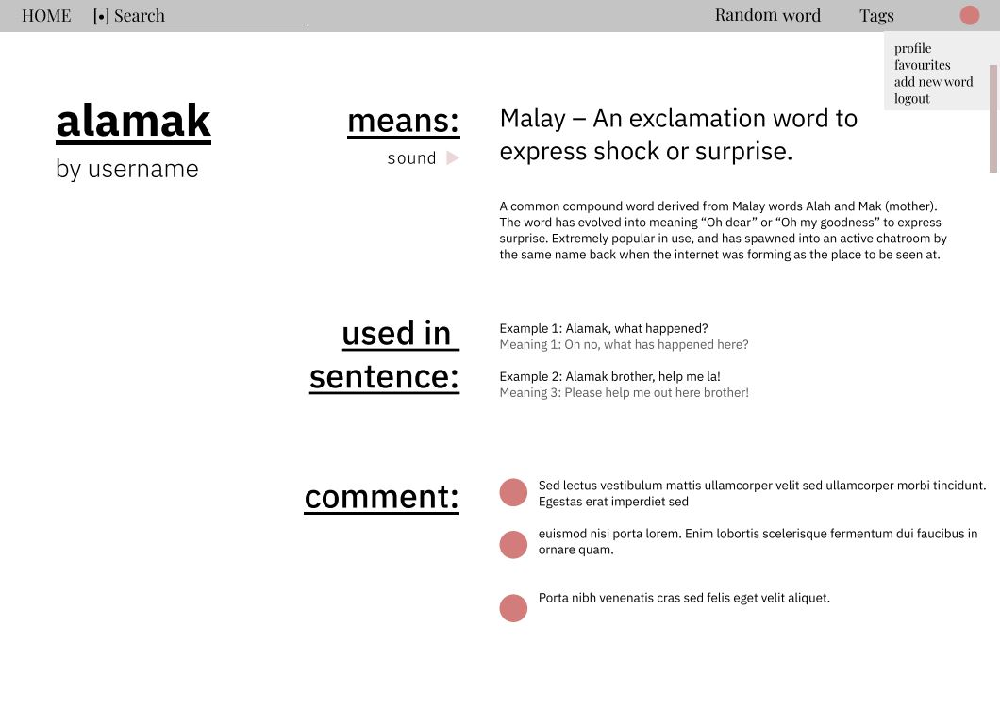

## SEI-23 Project 3 – Singlish

### Problem Statement
Many times, foreign visitors who are residing in Singapore find it hard to understand the locals' unoffical language. To create a more inculsive community, this is the <strong>Singlish app</strong>. 

### Wireframes, ERD
ERD:

Wireframes:

### MVP 
- User authentication
- CRUD for entries
- Comments
- Categories
- Tags
- Upload audio clips

### Further
- Create/edit user avatar
- Link to similar words
- Translator
- Quiz to test your Singlish skills

### Approach & Process
- Entity Relationship Diagram (ERD) for database relationships
- Wireframes for draft user interface and experience
- Trello for project management 
- Delegation of tasks according to strengths
- Every member works on separate feature git branch
- Multi-stage testing of merged code by group members
- Deploy and populate database on Heroku

### Technologies used
- Ruby on Rails
- HTML, CSS
- Bootstrap
- ActiveStorage
- Devise

#### References
Primary font: <a href="https://fonts.google.com/specimen/IBM+Plex+Sans?query=IBM+">IBM Sans Plex Font</a>

Secondary font: <a href="https://www.typewolf.com/site-of-the-day/fonts/playfair-display">Playfair Display</a> by Claus Eggers Sørensen

Deanin: <a href="https://www.youtube.com/watch?v=BYvzLYRIZK4&t=887s">Setting default avatar</a>

Inspiration sources:
<a href="https://www.singlish.net/">singlish.net</a>
<a href="http://www.singlishdictionary.com/">singlishdictionary.com</a>